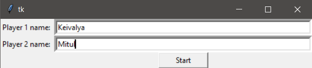
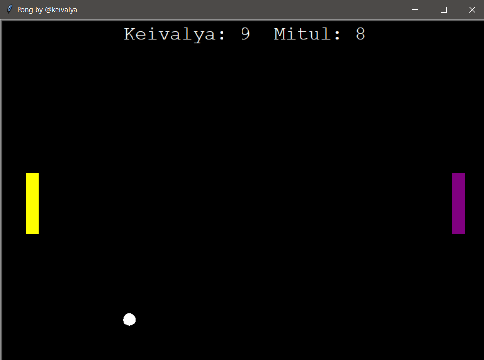

# pong

This is the super simple python PONG game,no worries about dependencies, you just need to python installed in your machine, that's it.

 


### Clone or Download

you can directly download zip file or you can clone this repo.
for clone the repo, make sure you installed gitbash on your system and then follow below commands

```sh
$ git clone https://github.com/keivalya/pong.git
```

Now you can see "Pong" folder in your working directory


### Start the game

```sh
$ cd pong
$ python pong.py
```


Now you can see the dialogbox shown in below,then enter the players name and click to start button.



Congratulations, your game is started and looks like below image.



### Control commands

 - Player1 : W/S 
 - Player2 : Arrow up/Arrow downn
 
 
 
 
 **Enjoy your day, Hell Yeah!**
