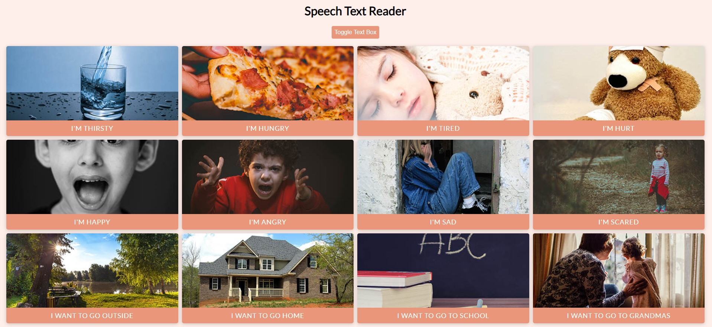

# Speech Text Reader
## screenshot


A text to speech app for non-verbal people. Pre-made buttons and custom text speech. This project uses the Web Speech API

## Project Specifications

- Create responsive UI (CSS Grid) with picture buttons
- Speaks the text when button clicked
- Drop down custom text to speech
- Speaks the text typed in
- Change voices and accents

## How to See
```sh
$ git clone https://github.com/anandmohan23/hactoberfest-Projects-2020.git
```
```sh
$ cd speeach-text-reader
```
click on *index.html*
